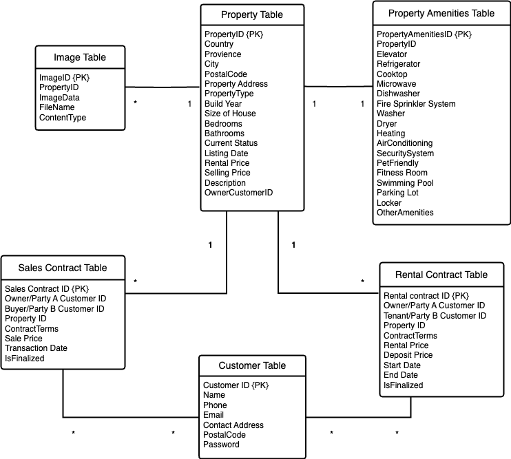

### Project Description
The intended users of this application include:
- Buyers and tenants, who are looking for properties in Greater Vancouver.
- Property owners, who want to sell or rent out their properties.

The application will feature the following pages:
- Home Page: A welcoming introduction to the platform.
- Registration/Login Page: Allowing users to sign up and log in.
- Property Listings Page: Displaying available properties with search and filtering options.
- Property Details Page: Providing detailed information on each property.
- Information Management Pages: For administrators to manage property and user information.
- AI Customer Service Page: Offering AI-powered assistance based on user inquiries.

The application will provide the following functionalities:
1. User Authentication: Secure login and logout for users.
2. Admin Management: Enabling administrators to maintain property listings and relevant data.
3. Property Listings Display: Presenting properties with advanced search and filtering capabilities.
4. Property Details Page: Showing comprehensive property information, including images and descriptions.
5. AI Customer Service: Utilizing AI to analyze user inquiries and provide personalized assistance and recommendations.

### ER Diagram

# Kanban

### todo

- show image on frontend
- merge customer table and AspNetUser table somehow
- figure out a bettter way to solve SQLite decimal ordering error

### finished
- Implement database paging on backend